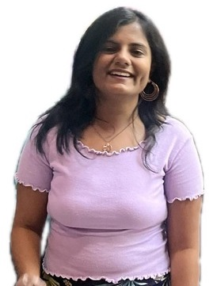

    

        
    

    

       Masters in Machine Learning 
        Carnegie Mellon University (alalan at cs dot cmu dot edu) 
        arshika77 at gmail dot com 
         
         
        Machine Learning Theory and Applications Research
    

# Bio

I am a Master of Science student in Machine Learning at [Carnegie Mellon University](https://www.ml.cmu.edu/), where I am learning to conduct specialized theoretical and applied machine learning research through PhD-level coursework in Advanced Machine Learning, Intermediate Statistics, and Deep Reinforcement Learning and Control. 

Previously, I worked as a predoctoral researcher at Google DeepMind (formerly [Google Research India](https://research.google/locations/india/)), focusing on developing robust reinforcement learning algorithms to build a policy for efficiently delivering health awareness information in underserved communities in India. 

Before that, I was a Research Assistant at the [Kreiman Lab](https://klab.tch.harvard.edu/) at Harvard University, where I worked on adopting continual learning algorithms for continuous domain adaptation.

My research interests lie in building and refining theoretical approaches to machine learning challenges in generative AI, reinforcement learning, and language models. I aim to contribute to the development of robust and adaptive AI systems that can effectively sense, interact with, and adapt to dynamic environments.

My resume is available [here](./img/Arshika_Lalan_Resume.pdf).

    

        

            
            
        

        

            BITS Pilani 
            2017 - 2022
        

    

    <!--- 

        

            
            
        

        

            Microsoft 
            2021
        

    
 --->
    

        

            
            
        

        

            Harvard University 
            2021-2022
        

    

    

        

            
            
        

        

            Google DeepMind 
            2022 - 2024
        

    

    

        

            
            
        

        

            Carnegie Mellon University 
            2024 - present
        

    

I graduated from [Birla Institute of Technology and Science (BITS), Pilani](https://www.bits-pilani.ac.in/goa/) in 2022. I enjoy writing as a medium of creative expression and you can find some of my works [here](https://bethenovelpoet.wordpress.com/), [here](https://store.pothi.com/book/arshika-lalan-dear-diary/) and [here](https://medium.com/@arshika77). I also am a avid reader, you can find my reading list [here](https://www.goodreads.com/user/show/132288929-arshika-lalan).

---

# Updates
- [Aug 2024] Joined [Carnegie Mellon University](https://www.ml.cmu.edu/) as a masters student in the Machine Learning Department!
- [Feb 24] Our work on **Improving Health Information Access in the World’s Largest Maternal Mobile
Health Program via Bandit Algorithms** was accepted at the **Innovative Applications of Artificial Intelligence 2024** was presented as an **Oral Presentation** at AAAI
- [May 23] Our preliminary work on **Analyzing and Predicting Low-Listenership Trends in a Large-Scale Mobile Health Program** was accepted at the **Data Science for Social Good Workshop, KDD 2023** as an **Oral Presentation**
- [Dec 22] Our work on **Adherence Bandits**, a specialized RMAB subclass designed to address the
complexities of adherence within the domain of public health got accepted at the **Artificial Intelligence for Social Good Workshop, AAAI 2023**
- [Aug 22] Joined [Google AI India](https://research.google/locations/india/) as Pre-Doctoral Reseacher! Working with [Milind Tambe](https://teamcore.seas.harvard.edu/tambe) within [MASSI](https://ai.google/social-good/).
- [Aug 21] Joined the [Kreiman Lab](https://klab.tch.harvard.edu/) at Harvard University!
- [Oct 21] Our work on ** a biologically inspired an SNN-based SDM utilizing N-of-M encoding** was aceepted at the Bernstein Conference 2021.
- [Aug 20] Accepted to [CBMM's](https://cbmm.mit.edu/) [Brain, Minds and Machines](https://cbmm.mit.edu/summer-school) Summer School!

    <a nohref>Read more</a>

# Publications

<h2 class="pubt">Improving Health Information Access in the World’s Largest Maternal Mobile
Health Program via Bandit Algorithms</h2>

    A Lalan*, S Verma*, P Diaz, P Danassis, A Mahale, K Sudan, A Hegde, M Tambe, A Taneja    
    Oral Presentation @ Innovative Applications of Artificial Intelligence (IAAI 2024) 
   <a target="_blank" href="https://ojs.aaai.org/index.php/AAAI/article/view/30329">Paper</a>
    

<!--  -->
<!-- 
 -->

<h2 class="pubt">Analyzing and Predicting Low-Listenership Trends in a Large-Scale Mobile Health Program: A Preliminary Investigation</h2>

    A Lalan, S Verma, K Sudan, A Mahale, A Hegde, M Tambe, A Taneja  
    Oral Presentation @ Data Science for Social Good Workshop, KDD 2023  
        <a target="_blank" href="https://arxiv.org/pdf/2311.07139.pdf">Paper</a>
    

<!--  -->
<!-- 
 -->

<h2 class="pubt">Adherence Bandits</h2>

    J Killian*, A Lalan*, A Mate*, M Jain, A Taneja, M Tambe  
    Artificial Intelligence for Social Good Workshop, AAAI 2023  
        <a target="_blank" href="https://amulyayadav.github.io/AI4SG2023/images/40.pdf">Paper</a>
    

<!--  -->
<!-- 
 -->

<h2 class="pubt">Continual Learning and Out of Domain Generalization in Continuous Domain Adaptation</h2>

    A Lalan, S Mandan, M Zhang, G Kreiman 
    Undergraduate Thesis 2022  
        <a target="_blank" href="https://arshika77.github.io/img/Thesis.pdf">Paper</a>
    

<!--  -->
<!-- 
 -->

<h2 class="pubt">Sparse Distributed Memory Using Spiking Neural Networks on Nengo</h2>

    R Ajwani, A Lalan, B Bhattacharya, J Bose 
    Bernstein Conference 2021 
    
        <a target="_blank" href="https://arxiv.org/pdf/2109.03111.pdf">Paper</a>
    

<!--  -->
<!-- 
 -->

<h2 class="pubt">Epigraphiology: A Hybrid Approach for Measuring and Analyzing Influence Diffusion in Article Networks</h2>

    S Dey, S Kotian, S Saha, A Agarwal, A Lalan, G Sampatrao 
    Journal of Scientometric Research 
    
       <a target="_blank" href="https://jscires.org/article/7434/">Paper</a>
    

<!--  -->
<!-- 
 -->

<!--  -->
<!-- 
 -->

---
